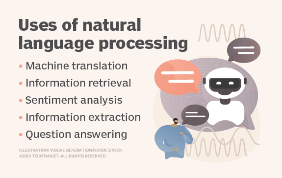
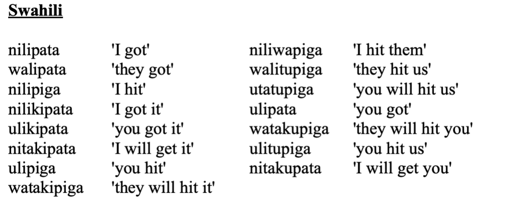
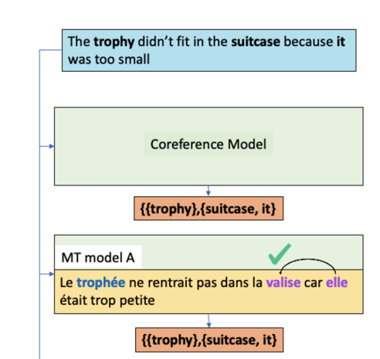

Three major areas of NLP.
- Machine Translation
- dialogue/Conversation/Chat
- Search
- Mood detaction
- Sign language 
  
Name
- Speech recognization
- Language Detection(Identification)/Machine translation

Yes

# Computational Linguistics (CL)
CL = CS + linguistics (important foundations)
As an interdisciplinary field, CL combines linguistics with computer science and artificial intelligence (AI) and is concerned with understanding language from a computational perspective.

The term computational linguistics is also closely linked to natural language processing (NLP), and these two terms are often used interchangeably.

## Applications of computational linguistics

- Machine translation
- Application clustering
  - This is the process of turning multiple computer servers into a cluster.
- Sentiment analysis
  - identifies the emotional tone behind a body of text.
- Chatbots
- Information extraction(Text summarization)
- Text mining. 
  - Text mining is the process of extracting useful information from massive amounts of unstructured textual data.

What exactly do you know, when you know a language?
What are the basic differences between languages?

## linguistic organization
- Phonetics & Phonology 
  - sounds and phonemes
  - Phonetics is concerned with **physical processes** that produce sounds.(eg: produced by lungs)
    - stop/fricative(keep sending air out)
    - vibrate or not
    - Close/open mouth
  - Phonology is concerned with how sounds are organized into systems used by particular languages, different bwtween languages
  
- Marphology
  - What do u know when u say u know a word
  - 
  - words
  - languages can vary in what kinds of affixes they have, where they go, and what they mean. 
  
  - Morphology is the study of the rules governing this variability. 
  
  - Part of the work of morphology is morphological analysis of unfamiliar languages; figuring out the lexicon for an unfamiliar language, and the rules for combining its parts.
  - A word is the smallest grammatically independent unit of a language.
  Words consist of one or more morphemes.
  - A main, meaning-bearing morpheme is called lexeme. An auxiliary, modifying morpheme is a grammatical morpheme.
  - Many morphological operations exist in human languages, including affixation, templating, and reduplication
  
- Syntax
  - Some words are vague (eg face can be verb and noun) we can check sytax to determain
- Semantics
  - Literal meaning of ohrases and sentences
- Discourse
  - Meaning in the content of discourse
  - Coherence
  - coreference 
    - Coreference means that certain elements in a discourse are references to earlier concepts.
    - 
    - Eg: here we know `it` refers to suitcase