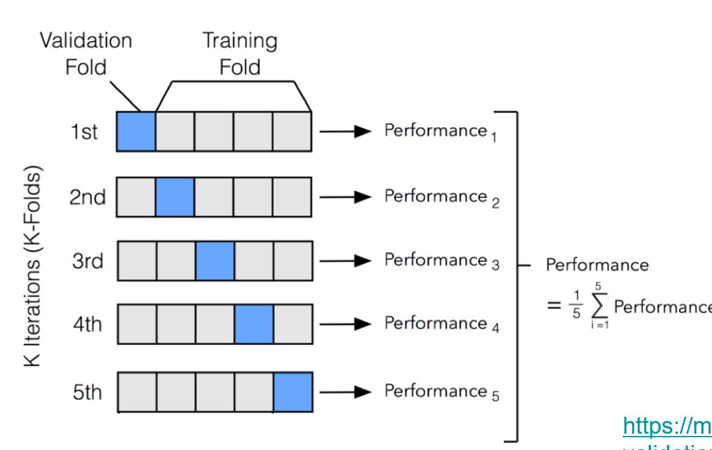
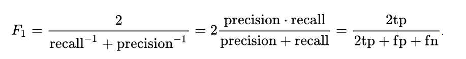

Scikit-learn provides dozens of built-in machine learning algorithms and models, called estimators. Each estimator can be fitted to some data using its fit method.

# Data Split 
- training
  -  usually most data goes to training
- validation
  - used to decide when to stop training
- testing
  - Verify how good the model is

# Hyperparameters and hyperparameter search

## About
- Learning Rate is a specific hyperparameter in gradient-based methods.
- Step Size can refer to the effective magnitude of a step in any optimization algorithm, which may or may not involve a learning rate as typically defined.
In most practical cases, learning rate and step size are used interchangeably in the context of gradient descent, but the distinction can become important when discussing other optimization techniques or advanced variations of gradient descent.

- Dropout is a technique where randomly selected neurons are ignored during training.
  - dropout rate of 0.5, meaning half of the neurons in the layer are randomly dropped out during training.

## Automated hyperparameter search
- grid search
  - Try out all probabilities
- random search
  - take a number of samples and choose the best
  - It't not about Quality, it's about the quantity (like SGD)

## Corse Validation

# Evaluation of NLP models
## General performance measures
- Accuracy
  - Exactly matched
  - Looking at accuracy only can hide actual model behaviour (The translation may not use the same words, but expressing the same meaning)
- Precision
  - The rate that model classifies as positive that are indeed correct. 
  - If the model say it's positove, how much can we believe in it
- Recall(查全)
  - The ablitiy of finding all positove results
  - focuses on capturing all positive instances and minimizing false negatives
- F Score
  - Balances recall and precision.
  - 
  - both precision and recall needs to be good in order to make F Score big 

## Task-specific performance measures in NLP
Each NLP task has its own definition of “success”, and more than one solutions may be correct.

### BLEU & Machine Translation

BLEU (BiLingual Evaluation Understudy) is a metric for automatically evaluating machine-translated text. 

The BLEU score is a number between zero and one that measures the similarity of the machine-translated text to a set of high quality reference translations.

### Language modeling
HMM & Bayesion Networks

compute the probability of next word, given previous texts

In language models, we can use `Perplexity` to measure a model's ability to predict the next word in a sequence

## Human evaluation
- human evaluation
  - Slow
  - Costyly
  - Reliable					
- automatic evaluation
  - Fast
  - Cheap
  - Somewhat reliable
  
However, humans can disagree with each other:
> We can use Inter-annotator agreement (IAA) , which is the degree of consensus or similarity among the annotations made by different annotators on the same data. We can use it to quantify the agreement between several annotators. 
